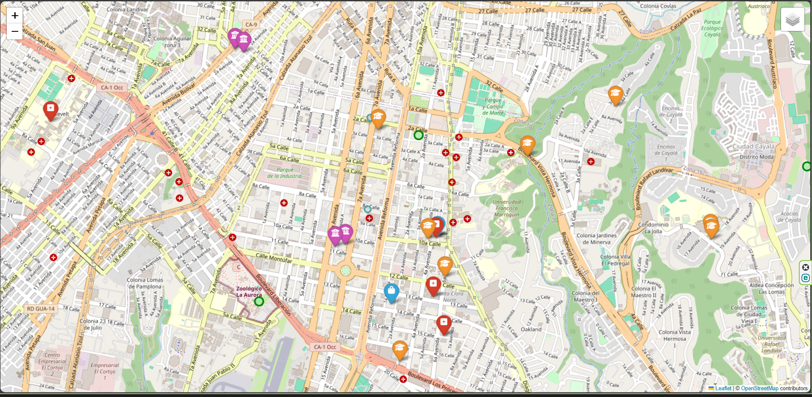
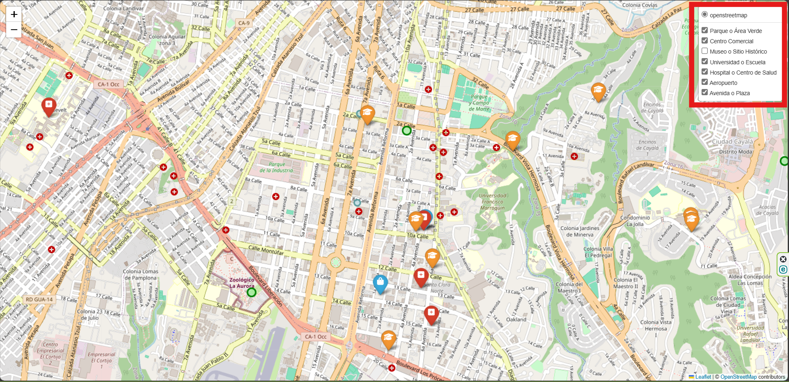

# Mapa Interactivo de Lugares en Ciudad de Guatemala

Este proyecto crea un mapa interactivo de varios lugares en Ciudad de Guatemala, utilizando la biblioteca `folium` en Python. **Es un proyecto experimental para probar las funcionalidades de la biblioteca `folium`, por lo que algunas ubicaciones en el archivo de lugares pueden no ser exactas.**

## Descripción del Proyecto

El mapa incluye diferentes lugares como parques, centros comerciales, museos, universidades, hospitales y avenidas. Está diseñado para ofrecer una visualización clara y flexible, permitiendo al usuario activar y desactivar capas específicas a través de un control de capas (`LayerControl`).

### Tipos de Lugares y Configuración de Estilos

Cada tipo de lugar tiene una configuración específica para su marcador o círculo, definida en el diccionario `tipo_config`. A continuación se detallan los tipos de lugar y su estilo en el mapa:

| Tipo | Descripción                  | Color/Estilo               |
|------|------------------------------|----------------------------|
| PR   | Parques o áreas verdes       | Círculo verde claro        |
| CC   | Centros comerciales          | Icono de bolsa, azul       |
| MU   | Museos o sitios históricos   | Icono de universidad, morado|
| UN   | Universidades, colegios      | Icono de birrete, naranja  |
| HO   | Hospitales o centros de salud| Icono de cruz, rojo        |
| AE   | Aeropuertos                  | Icono de avión, gris       |
| AV   | Avenidas o plazas            | Círculo azul claro         |

## Instalación

1. Clona este repositorio o descarga los archivos.
2. Instala las dependencias requeridas utilizando `pip`:
   ```bash
   pip install folium pandas
3. Asegúrate de tener el archivo `Lugares.txt` en formato CSV con la estructura:
    ```bash
    NOMBRE, LAT, LOG, TIPO
## Uso

1. Corre el script de Python para generar el mapa:

    ```bash
    python map1.py
2. El mapa se guardará en el archivo Map1.html, que puedes abrir en cualquier navegador para ver los lugares.

A continuación, se muestra cómo se ve el mapa cuando está abierto en el navegador:



En este mapa, puedes ver los diferentes marcadores para cada tipo de lugar, organizados por capas.

Y aquí está la vista del mapa con el control de capas (`LayerControl`), que te permite activar o desactivar las capas que desees:



### Explicación del Control de Capas

El `LayerControl` te permite interactuar con las capas del mapa, habilitando o deshabilitando las distintas características del mapa. Puedes activar o desactivar las capas como "Parques", "Centros Comerciales", etc., de acuerdo con tus necesidades.

## Estructura del codigo

* `tipo_config`: Configuración de cada tipo de lugar en el mapa.
* `getChild(tipo, latitud, longitud, lugar)`: Función que genera el marcador o círculo con el estilo correspondiente.
* `FeatureGroup`: Crea grupos de capas en el mapa para cada tipo de lugar.
* `LayerControl`: Añade un control de capas al mapa, permitiendo al usuario seleccionar los tipos de lugares a visualizar.

## Archivos

* `map1.py`: Script principal para generar el mapa interactivo.
* `Lugares.txt`: Archivo CSV con la lista de lugares y sus coordenadas.
* `Map1.html`: Archivo HTML generado que contiene el mapa interactivo.

## Contribuciones

Este proyecto es solo una prueba para experimentar con `folium`. Si deseas contribuir al proyecto, puedes realizar un pull request con tus mejoras o sugerencias.

## Licencia

Este proyecto está bajo la Licencia MIT. Puedes ver el archivo LICENSE para más detalles.